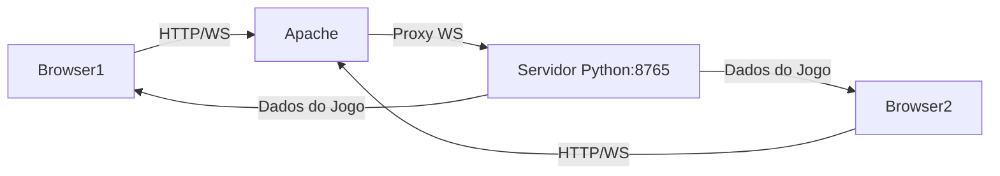

<p align="center">
  
</p>

# Block Shuffle 🌐🎮

Um jogo multiplayer de combinação de blocos em tempo real utilizando WebSocket, Python e Apache na AWS

## 🌟 Visão Geral
Block Shuffle é um jogo de puzzle competitivo onde dois jogadores conectam-se simultaneamente para fazer combinações de blocos coloridos. A arquitetura utiliza:

- **Backend**: Python com WebSockets para comunicação em tempo real
- **Frontend**: Interface web responsiva
- **Infraestrutura**: Hospedado em AWS EC2 com Apache como proxy reverso

## 📦 Stack Tecnológica

| Componente       | Tecnologia |
|-----------------|------------|
| **Backend**     | Python + websockets |
| **Frontend**    | HTML5, CSS3, JavaScript |
| **Servidor Web**| Apache HTTP Server |
| **Cloud**       | AWS EC2 (Ubuntu) |
| **Protocolo**   | WebSocket (ws://) |

## 🚀 Configuração na AWS

### Pré-requisitos
- Instância EC2 (t2.micro ou superior)
- Security Group liberando portas:
  - 22 (SSH)
  - 80 (HTTP)
  - 8765 (WebSocket)

### 1. Instalação do Apache com suporte a WebSocket
```bash
sudo apt update
sudo apt install apache2 -y

# Habilitar módulos necessários
sudo a2enmod proxy proxy_http proxy_wstunnel rewrite
sudo systemctl restart apache2
```

### 2. Configuração do Virtual Host

```bash
sudo nano /etc/apache2/sites-available/block-shuffle.conf
```
Com o conteúdo:

```bash
<VirtualHost *:80>
    ServerName seu-ip-ou-dominio.com
    DocumentRoot /var/www/blockshuffle

    # Configuração WebSocket
    RewriteEngine On
    RewriteCond %{HTTP:Upgrade} =websocket [NC]
    RewriteRule /(.*) ws://localhost:8765/$1 [P,L]
    
    ProxyPass "/ws/" "ws://localhost:8765/"
    ProxyPassReverse "/ws/" "ws://localhost:8765/"

    ProxyRequests Off
    ProxyVia Off

    <Directory /var/www/blockshuffle>
        Options Indexes FollowSymLinks
        AllowOverride All
        Require all granted
    </Directory>

    ErrorLog ${APACHE_LOG_DIR}/error.log
    CustomLog ${APACHE_LOG_DIR}/access.log combined
</VirtualHost>
```
Ative o site:

```bash
sudo a2ensite block-shuffle
sudo systemctl restart apache2
```

## 🎮 Como Executar
No Servidor (EC2)
```bash
# Instalar dependências
pip3 install websockets

# Iniciar servidor
python3 server.py
```

## 📊 Arquitetura do Sistema



## 📜 Comandos Úteis

```bash
sudo systemctl status apache2   #Verifica status do Apache
sudo journalctl -u blockshuffle.service    #Visualiza logs do servidor do jogo
sudo tail -f /var/log/apache2/access.log    #Monitora acessos em tempo real
```

